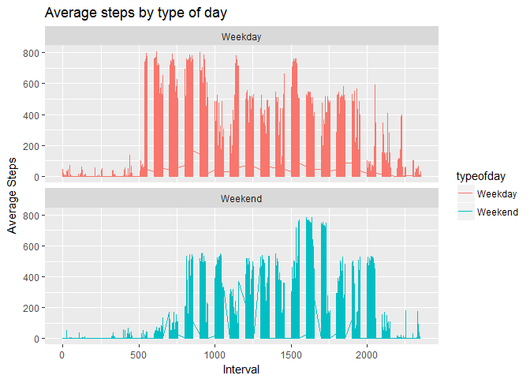

# Reproducible Research: Peer Assessment 1


## Loading and preprocessing the data

```r
activity <- read.csv("data/activity.csv")
str(activity)
```

```
## 'data.frame':	17568 obs. of  3 variables:
##  $ steps   : int  NA NA NA NA NA NA NA NA NA NA ...
##  $ date    : Factor w/ 61 levels "2012-10-01","2012-10-02",..: 1 1 1 1 1 1 1 1 1 1 ...
##  $ interval: int  0 5 10 15 20 25 30 35 40 45 ...
```

```r
summary(activity)
```

```
##      steps                date          interval     
##  Min.   :  0.00   2012-10-01:  288   Min.   :   0.0  
##  1st Qu.:  0.00   2012-10-02:  288   1st Qu.: 588.8  
##  Median :  0.00   2012-10-03:  288   Median :1177.5  
##  Mean   : 37.38   2012-10-04:  288   Mean   :1177.5  
##  3rd Qu.: 12.00   2012-10-05:  288   3rd Qu.:1766.2  
##  Max.   :806.00   2012-10-06:  288   Max.   :2355.0  
##  NA's   :2304     (Other)   :15840
```


## What is mean total number of steps taken per day?
First we aggregate the number of steps per day (you'll see a snapshot printed).

```r
total_steps_perday <- aggregate(steps ~ date, data = activity, FUN = sum, na.rm = TRUE)
head(total_steps_perday)
```

```
##         date steps
## 1 2012-10-02   126
## 2 2012-10-03 11352
## 3 2012-10-04 12116
## 4 2012-10-05 13294
## 5 2012-10-06 15420
## 6 2012-10-07 11015
```

And here you can see the how the user's activity varies and the associated mean and median.


```r
library(ggplot2)
qplot(total_steps_perday$steps, xlab="Total steps per day", ylab="Frequency")
```

```
## `stat_bin()` using `bins = 30`. Pick better value with `binwidth`.
```

<!-- -->

```r
mean(total_steps_perday$steps, na.rm=TRUE)
```

```
## [1] 10766.19
```

```r
median(total_steps_perday$steps, na.rm=TRUE)
```

```
## [1] 10765
```

## What is the average daily activity pattern?

```r
steps_by_interval <- aggregate(steps ~ interval, activity, mean)
plot(steps_by_interval$interval,steps_by_interval$steps,type="l",xlab= "Interval", ylab="Average Number of Steps", main="Average Number of Steps by Interval over time")
```

<!-- -->

Which 5-minute interval, on average across all the days in the dataset, contains the maximum number of steps?


```r
max_interval <- steps_by_interval$interval[which.max(steps_by_interval$steps)]
max_interval
```

```
## [1] 835
```

## Imputing missing values
The total number of missing values in the dataset (i.e. the total number of rows with NAs).

```r
missing <- is.na(activity$steps)
table(missing)
```

```
## missing
## FALSE  TRUE 
## 15264  2304
```
Replacing the missing values with the interval's mean.


```r
corr_activity <- activity
missing_boolean <- is.na(corr_activity$steps)
avg_interval <- tapply(corr_activity$steps, corr_activity$interval, mean, na.rm=TRUE)
corr_activity$steps[missing_boolean] <- avg_interval[as.character(corr_activity$interval[missing_boolean])]
```
Show corrected activity of the user per interval and the associated meand and median.


```r
corr_total_steps_perday <- aggregate(steps ~ date, data = corr_activity, FUN = sum, na.rm = TRUE)
head(corr_total_steps_perday)
```

```
##         date    steps
## 1 2012-10-01 10766.19
## 2 2012-10-02   126.00
## 3 2012-10-03 11352.00
## 4 2012-10-04 12116.00
## 5 2012-10-05 13294.00
## 6 2012-10-06 15420.00
```

```r
qplot(corr_total_steps_perday$steps, xlab="Total steps per day with nas corrected", ylab="Frequency")
```

```
## `stat_bin()` using `bins = 30`. Pick better value with `binwidth`.
```

<!-- -->

```r
mean(corr_total_steps_perday$steps, na.rm=TRUE)
```

```
## [1] 10766.19
```

```r
median(corr_total_steps_perday$steps, na.rm=TRUE)
```

```
## [1] 10766.19
```

## Are there differences in activity patterns between weekdays and weekends?

```r
library(lubridate)
```

```
## 
## Attaching package: 'lubridate'
```

```
## The following object is masked from 'package:base':
## 
##     date
```

```r
library(dplyr)
```

```
## 
## Attaching package: 'dplyr'
```

```
## The following objects are masked from 'package:lubridate':
## 
##     intersect, setdiff, union
```

```
## The following objects are masked from 'package:stats':
## 
##     filter, lag
```

```
## The following objects are masked from 'package:base':
## 
##     intersect, setdiff, setequal, union
```

```r
library(plyr)
```

```
## -------------------------------------------------------------------------
```

```
## You have loaded plyr after dplyr - this is likely to cause problems.
## If you need functions from both plyr and dplyr, please load plyr first, then dplyr:
## library(plyr); library(dplyr)
```

```
## -------------------------------------------------------------------------
```

```
## 
## Attaching package: 'plyr'
```

```
## The following objects are masked from 'package:dplyr':
## 
##     arrange, count, desc, failwith, id, mutate, rename, summarise,
##     summarize
```

```
## The following object is masked from 'package:lubridate':
## 
##     here
```

```r
corr_activity <- corr_activity%>%mutate(typeofday= ifelse(weekdays(as.Date(corr_activity$date))=="zondag" | weekdays(as.Date(corr_activity$date))=="zaterdag", "Weekend", "Weekday"))
```

Calculate the mean for each interval.


```r
average_steps_bytypeofday <- aggregate(steps ~ interval + typeofday, data = corr_activity, FUN = mean, na.rm = TRUE)
head(average_steps_bytypeofday)
```

```
##   interval typeofday      steps
## 1        0   Weekday 2.25115304
## 2        5   Weekday 0.44528302
## 3       10   Weekday 0.17316562
## 4       15   Weekday 0.19790356
## 5       20   Weekday 0.09895178
## 6       25   Weekday 1.59035639
```


```r
ggplot(corr_activity, aes(x =interval , y=steps, color=typeofday)) +
       geom_line() +
       labs(title = "Average steps by type of day", x = "Interval", y = "Average Steps") +
       facet_wrap(~ typeofday, ncol = 1, nrow=2)
```

<!-- -->
